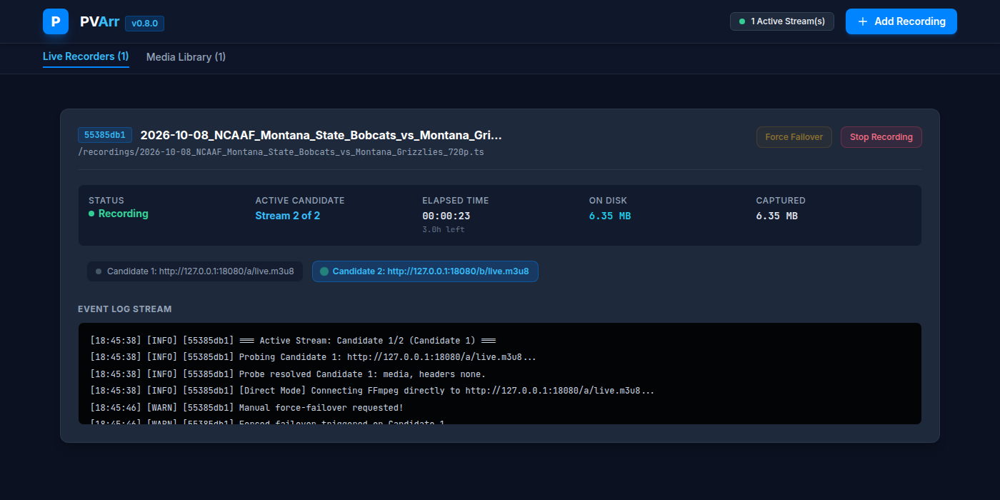

# PVArr — a self-hosted DVR for live HLS streams

> **🤖 AI Transparency Notice:** PVArr was designed, architected, and built by AI across multiple LLM sessions with a human in the loop. Google Gemini drew the initial architecture; Anthropic Claude has been the primary architect and maintainer since, and does the ongoing design, implementation, testing, and review. See [AI Genesis & Environmental Footprint](#ai-genesis--environmental-footprint).

Pronounced *peevee-ARRRR*, like a pirate, matey.

PVArr records live HLS streams (the "playlist of short video chunks" format most web video uses) to one clean file. Give it up to three links to the same event and it records the whole thing, switching to a backup automatically when a source dies or freezes, and keeping one continuous timeline across the switch. While it records, the stream shows up in Plex, Jellyfin or Emby as a live channel. No database, no accounts, no cloud.



**What it does**

- **Failover that keeps going.** A primary plus two backups; on a stall, a crash or a silent freeze it moves to the next source, and cycles back round rather than giving up while the event is still on.
- **One file, one timeline.** Every switch is appended to the same recording with its clock continued, so the file plays and seeks correctly even while it is still being written. Finished recordings are remuxed to MP4 (no transcode).
- **Paste and record.** Paste a stream URL or the page that plays it; PVArr finds the playlist, works out the headers it needs, and checks a real segment downloads before you start.
- **Set it and walk away.** One-shot schedules with a start and end time; recordings survive container restarts and stop cleanly at their end time.
- **Live TV in your media server.** A virtual HDHomeRun / M3U tuner with a guide that says which source is feeding each recording.
- **Optional extras.** Commercial chapter marks via comskip, notifications via Apprise (ntfy, Gotify, Discord, Telegram, email and 100+ more), offline league/team autocomplete for tidy filenames.

---

## Intended use

PVArr records streams you are entitled to watch: your own cameras and encoders, LAN tuners and IPTV boxes, free-to-air and local broadcasters' web streams, public meetings, conferences, and subscription streams whose terms allow it. What you record, and whether you are allowed to, is your responsibility.

- **No DRM, ever.** PVArr does not decrypt DRM (Widevine, FairPlay, PlayReady) and will not support it. It does not circumvent access controls on licensed services: where a page needs a login or a browser session, you supply your own.
- **No site-specific support.** PVArr contains no site-specific code and ships no stream lists. Site lists or support for specific sites will not be provided or accepted, and issues asking for them will be closed.
- **Don't post stream URLs in issues.** Use **Copy trace** on the dashboard, which strips tokens from every URL.

PVArr sends no telemetry and contacts nothing except the URLs you give it (and ESPN's public team list, only when a maintainer runs the `--refresh` command).

---

## Quick start

**Requirements:** Docker with Compose, on **Linux amd64** (x86-64). The image is amd64 only and about **900 MB**; there is no ARM build for a Raspberry Pi or ARM NAS yet.

1. Save [`docker-compose.yml`](docker-compose.yml) in an empty folder, and next to it a `.env` with your user, group and timezone:

   ```bash
   cat > .env <<EOF
   PUID=$(id -u)
   PGID=$(id -g)
   TZ=America/Denver
   EOF
   ```

   `TZ` matters: recordings are named by date, and without it the container runs on UTC, so an evening recording gets tomorrow's date.

2. Start it:

   ```bash
   docker compose up -d
   ```

3. Open <http://localhost:8999>. Recordings land in `./recordings`; session state in `./config`.

To build from source, pin a version, or run without Docker, see [Installation and configuration](docs/installation.md).

> **Keep it on your LAN.** PVArr has no login. Anything that can reach port 8999 can start, stop and delete recordings. Do not port-forward it; put it behind a reverse proxy with authentication if it must leave your network.

## Your first recording

1. Press **Add Recording**.
2. Fill in **Sport**, **Team A** and **Team B** (they name the file, e.g. `2026-10-08_NCAAF_Montana_State_Bobcats_vs_Montana_Grizzlies_720p.mp4`; anything works, autocomplete is just a convenience).
3. Open **Enter stream links manually** and paste the stream into **Primary**. Paste the **page that plays the stream** rather than an `.m3u8` copied from DevTools when you can: PVArr re-resolves a page every time it connects, so a token that expires mid-event is renewed instead of replayed. A green line under the field means the probe found a playlist and a segment downloads.
4. Add **Backup 1** and **Backup 2** if you have them. A backup from a *different* source is worth more than a second link to the same one.
5. Optionally set **Stop After (min)**, then press **Start Recording Session**.

The card shows which source is live, how much has been captured, and any segments the source failed to deliver. Click a source to switch to it, or **Force Failover** to move on. When the recording stops it is remuxed to `.mp4` and appears in the **Library** tab. If the probe goes red, [Finding the stream URL](docs/finding-streams.md) explains what each result means.

If you have a page that links to several sources for the same event, paste it into **Event page** and press **Find 3 streams**: PVArr checks the links on it and fills the three slots with the first three that actually play. See [Event pages](docs/event-pages.md).

## Scheduling

Set **Start at** and **End at** on the same form; the button changes to **Schedule**. At the start time PVArr checks the event page (if you gave one), takes the first three working streams, tops up with any links you entered manually, and records until the end time. If nothing plays yet it retries every few minutes until the window closes and notifies you. Schedules survive a restart, and a job leaves the list as soon as its recording starts (the recording's own card takes over). One-shot only; for something recurring, use cron with `curl` against the API. Details: [Event pages and scheduling](docs/event-pages.md#scheduling-a-recording).

## Watching in Plex, Jellyfin or Emby

PVArr emulates an HDHomeRun tuner. In Plex: **Settings → Live TV & DVR → Set up Plex DVR**, enter `http://<pvarr-host>:8999` as the device address, and `http://<pvarr-host>:8999/live/epg.xml` as the XMLTV guide. Jellyfin and Emby use the M3U playlist at `/live/playlist.m3u`. Each running recording appears as a channel, so you can watch an event while it records. Details: [Plex, Jellyfin and Emby](docs/tuner.md).

---

## Documentation

| Page | What's in it |
|---|---|
| [Features in detail](docs/features.md) | Every feature, with the reasoning behind its defaults |
| [Installation and configuration](docs/installation.md) | Compose, building from source, pinning versions, requirements, every environment variable |
| [Finding the stream URL](docs/finding-streams.md) | How the probe works, what to paste, reading the probe trace, manual headers |
| [Event pages and scheduling](docs/event-pages.md) | Finding three working streams from one page, pages that need your browser session, schedules |
| [FlareSolverr](docs/flaresolverr.md) | Optional helper for event pages that need a real browser, and how to keep it off your LAN |
| [Plex, Jellyfin and Emby](docs/tuner.md) | Virtual tuner setup, what the guide shows, gaps at a failover |
| [Commercial detection](docs/comskip.md) | comskip chapters or cuts, tuning and scoring an ini |
| [HTTP API](docs/api.md) | Every endpoint, for scripts and cron |
| [Troubleshooting](docs/troubleshooting.md) | Common problems, fixes in earlier versions, measuring a host |
| [Development](docs/development.md) | Architecture, tests, refreshing the team list, releasing |

Support is best effort from a single maintainer. Bug reports are most useful with the PVArr version, how you installed it, your host's architecture, and the probe's **Copy trace** output.

---

## License

[The Unlicense](LICENSE) — public domain. Do whatever you want with it; no attribution required.

---

## AI Genesis & Environmental Footprint

This program was written by machines. Gemini drew the first architecture; Claude has held the pen since — architecture, code, tests, and the audits that keep finding things wrong with all three — and a human points, decides, and reviews. Stated plainly, because the industry mostly doesn't.

The Luddites are misremembered as people who hated machines. They were skilled workers who broke the specific machines being used to break them. The question was never *machines or no machines* — it was *whose hands are on them, and who eats*. Same question here. These models were trained on an enormous pile of other people's work. Nobody asked, nobody paid. That's a debt, and it has no payment address.

**What it cost the planet: unknown, and not by accident.** Nobody metered this build, and the firms that could tell you what a token costs in watts and litres decline to publish it. "The cloud" is a shed full of hot metal in somebody's watershed. Treat any precise gram-of-CO₂ figure — including one that could easily have been invented right here — as marketing.

**Offsets are indulgences.** Buying one un-burns nothing, and the voluntary market is thick with fraud. If you want to send money anyway, send it where it does something structural:

- **[Cool Earth](https://www.coolearth.org)** — hands cash to forest communities to keep their land. No carbon accounting theatre.
- **[Wren](https://www.wren.co)** — monthly subscription, the buy-me-a-coffee of climate guilt. Cheaper than the DVR subscription you just cancelled.

But the donate button is not the point. The point is that you now own a video recorder. No subscription, no account, no telemetry, nothing phoning home, nobody able to switch it off from a boardroom. That is one small thing clawed back out of the rental economy.

***Go do it again somewhere else.***

---

**Maintainer:** jlester.ak
**License:** [The Unlicense](LICENSE) — public domain
